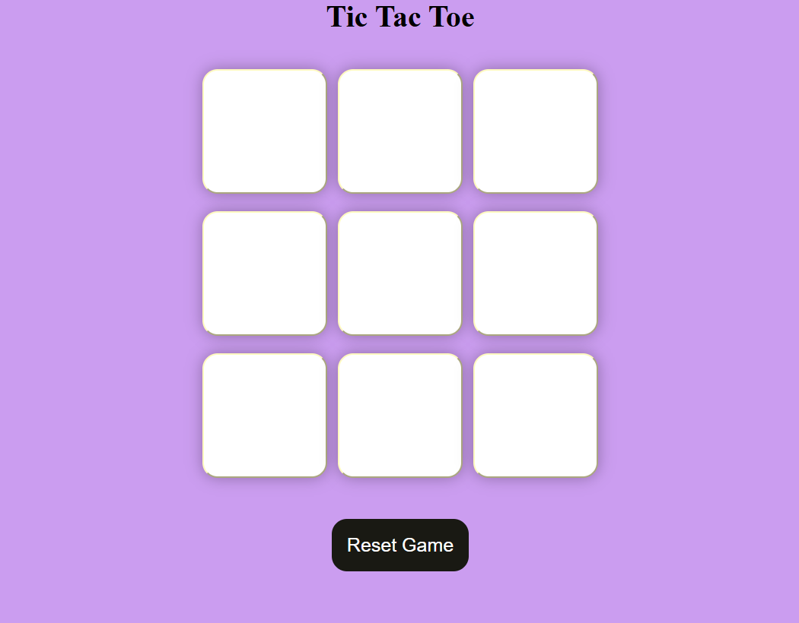

#                                         TIC-TAC-TOE

## How to play?
1. The game is played between two players.
2. Players take turns placing their symbol ("X" or "O") in an empty cell.
3. The first player to align three symbols in a row, column, or diagonal wins.
4. If all nine cells are filled without a winner, the game ends in a draw.

## Technologies used
- HTML, CSS and JavaScript

## Objective of this copy
Testing my knowledge on these technologies and having fun! :)
